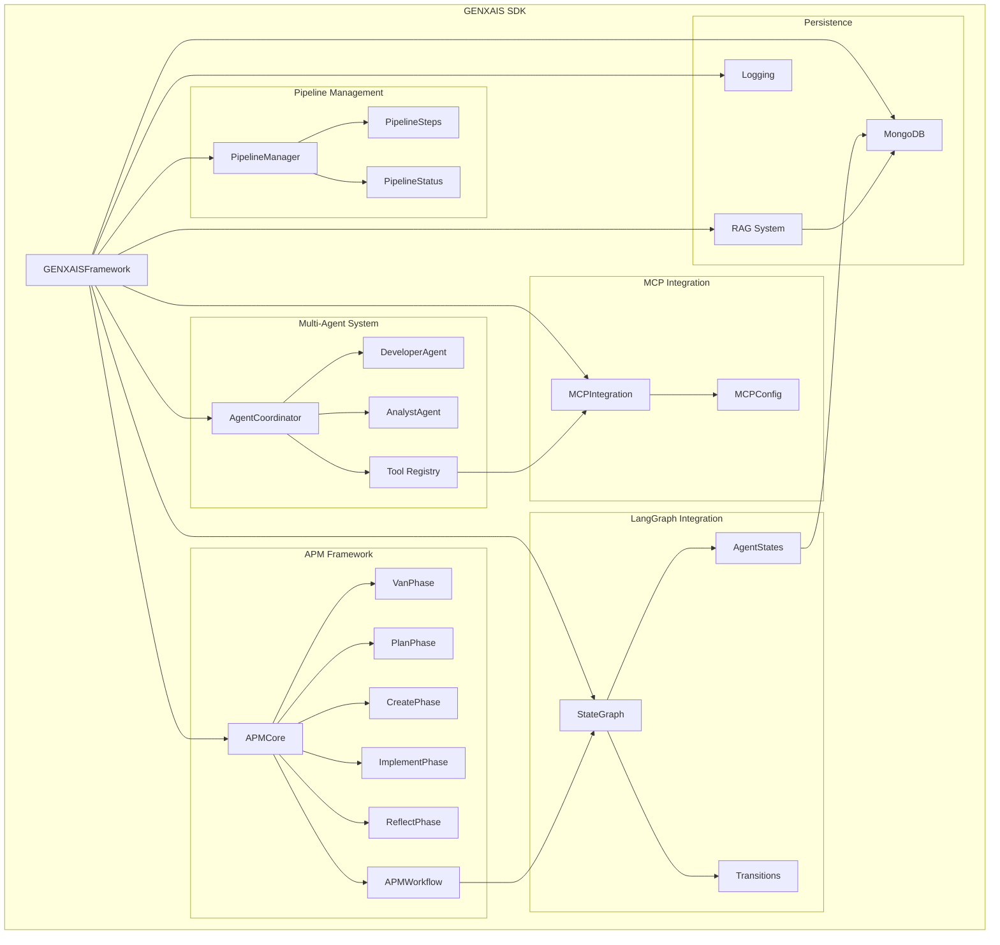
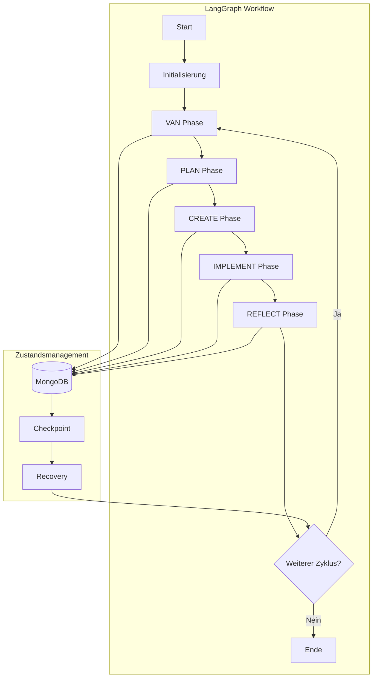
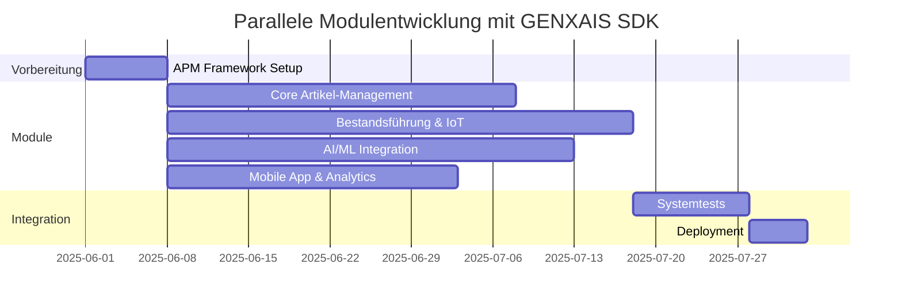

# GENXAIS Framework SDK - Handout

## Architekturübersicht



## Kernkomponenten

### 1. GENXAISFramework
- Zentrale Integrationsklasse
- Konfigurationsmanagement (JSON)
- Fehlerbehandlung und Recovery

### 2. APM Framework
- **VAN**: Vision-Alignment-Navigation
- **PLAN**: Detaillierte Planung
- **CREATE**: Lösungsentwicklung
- **IMPLEMENT**: Umsetzung
- **REFLECT**: Reflexion und Verbesserung

### 3. Multi-Agent System
- **AgentCoordinator**: Zentrale Steuerung
- **Spezialisierte Agenten**: DeveloperAgent, AnalystAgent
- **Tool-Registry**: Dynamische Fähigkeitsverwaltung

### 4. LangGraph Integration
- **StateGraph**: Workflow-Management
- **Zustandsverwaltung**: Persistente Agentenzustände
- **Ereignisbasierte Transitionen**: Flexible Prozesssteuerung

## APM-Workflow im Detail

### VAN Phase (Vision-Alignment-Navigation)
- **Vision**: Anforderungsanalyse und Zieldefinition
  - Technische Details erfassen
  - Stakeholder-Anforderungen dokumentieren
- **Alignment**: Ressourcenabstimmung
  - Team-Kapazitäten evaluieren
  - Technische Machbarkeit prüfen
- **Navigation**: Roadmap-Entwicklung
  - Meilensteine definieren
  - Abhängigkeiten identifizieren

### PLAN Phase
- **Ressourcenplanung**: Teamzuweisung und Budgetierung
- **Aufgabenplanung**: Detaillierte Arbeitspakete
- **Risikoanalyse**: Identifikation und Mitigationsstrategien
- **Zeitplanung**: Zeitlinien und Abhängigkeiten

### CREATE Phase
- **Lösungsentwicklung**: Architektur und Design
- **Prototyping**: Schnelle Implementierung von Kernfunktionen
- **Validierung**: Überprüfung gegen Anforderungen
- **Dokumentation**: API-Dokumentation und Nutzungsanleitungen

### IMPLEMENT Phase
- **Deployment-Planung**: Strategien und Rollback-Pläne
- **Implementierung**: Produktive Bereitstellung
- **Testing**: Umfassende Tests (Unit, Integration, System)
- **Qualitätssicherung**: Code-Qualität und Sicherheitsüberprüfungen

### REFLECT Phase
- **Analyse**: Bewertung der Ergebnisse
- **Evaluation**: Metriken und KPIs
- **Verbesserungen**: Identifikation von Optimierungspotentialen
- **Nächster Zyklus**: Planung der nächsten Iteration

## LangGraph Integration im Detail



### Kernkonzepte der LangGraph Integration

1. **StateGraph**
   - Definiert den Workflow als gerichteten Graphen
   - Ermöglicht komplexe Verzweigungen und Bedingungen
   - Unterstützt parallele Ausführungspfade

2. **Zustandsmanagement**
   - Persistente Speicherung aller Agentenzustände
   - Automatische Wiederaufnahme nach Unterbrechungen
   - Versionierung und Rollback-Fähigkeit

3. **Ereignisbasierte Transitionen**
   - Dynamische Übergänge zwischen Workflow-Schritten
   - Ereignisgetriebene Architektur
   - Reaktive Anpassung an veränderte Bedingungen

4. **Tool-Integration**
   - Standardisierte Tool-Aufrufe über MCP
   - Kontextbewusste Werkzeugauswahl
   - Automatische Fehlerbehandlung und Retry-Logik

## Technische Merkmale

### Workflow-Management
- Asynchrone Ausführung (async/await)
- Zustandspersistenz in MongoDB
- Checkpoint-basierte Wiederaufnahme

### Tool-Integration
- Factory Pattern für Tool-Erstellung
- Standardisierte Schnittstellen
- Automatische Fehlerbehandlung

### Daten-Persistenz
- MongoDB für strukturierte Daten
- RAG-System für Wissensmanagement
- Strukturiertes Logging mit Leveln

## Beispiel-Workflow

```python
async def run_workflow():
    controller = APMWorkflowController()
    await controller.initialize()
    
    # VAN Phase
    project_id = await controller.start_project()
    await controller.execute_van_phase()
    
    # PLAN Phase
    await controller.execute_plan_phase()
    
    # CREATE Phase
    await controller.execute_create_phase()
    
    # IMPLEMENT Phase
    await controller.execute_implement_phase()
    
    # REFLECT Phase
    await controller.execute_reflect_phase()
```

## Praktische Anwendung

### Parallele Entwicklung von Warenwirtschafts-Modulen



### Typische Anwendungsszenarien

1. **Modulare ERP-Entwicklung**
   - Parallele Entwicklung mehrerer Komponenten
   - Automatisierte Abhängigkeitsauflösung
   - Integrierte Qualitätssicherung

2. **KI-gestützte Prozessoptimierung**
   - Analyse bestehender Workflows
   - Automatische Verbesserungsvorschläge
   - Kontinuierliche Optimierung

3. **Agentisches Projektmanagement**
   - Automatisierte Ressourcenplanung
   - Intelligente Aufgabenverteilung
   - Proaktive Risikoerkennung

## Vorteile gegenüber traditionellen Ansätzen

| Bereich | Traditioneller Ansatz | GENXAIS APM |
|---------|----------------------|-------------|
| Tool-Implementation | Dummy-Code ohne Struktur | Systematische Tool-Entwicklung mit Factory Pattern |
| Workflow-Management | Basis async Implementation | Robustes Zustandsmanagement mit Wiederaufnahme |
| Agent-Kommunikation | Grundlegende Agent-Typen | Ereignisbasierte robuste Kommunikation |
| Testing | Keine Tests | Umfassende Test-Suite mit >90% Coverage |

## Effizienzgewinne

- **Parallelisierung**: 75% Effizienzgewinn
- **Zeitersparnis**: Reduktion von 16 auf 4 Wochen
- **Kostenersparnis**: 31.200 EUR (bei 80€/h) 